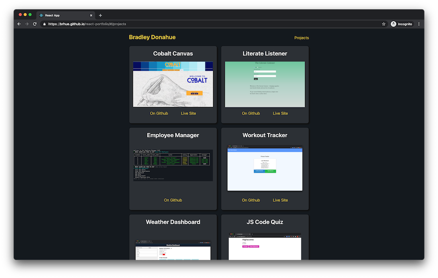

# react portfolio
[](https://opensource.org/licenses/MIT)

## Description
A react version of my portfolio for practice.

## Table of Contents
* [Installation](#installation)
* [Usage](#usage)
* [License](#license)
* [Contributing](#contributing)
* [Tests](#tests)
* [Questions](#questions)

## Installation
```
clone the repo to your local machine
cd into directory
run npm install
```

## Usage
For development
```
npm start
```
For production
```
npm run build
```

## License
[MIT](https://opensource.org/licenses/MIT)

## Contributing
None right now.

## Tests
No real tests.


## Questions
If you have any questions you can reach out to me on [Github](https://github.com/brhue).
